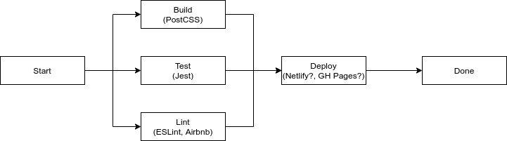

# CI/CD Pipeline Phase 1 Status

In order to proceed with proper development of our web application, we require a
CI/CD pipeline that can help us increase developer velocity as well as reduce
the number of bugs introduced into the codebase, along with the potential of
inconsistent code style. Since our project consists entirely of a frontend
implementation, all that is required is for us to properly manage and deliver
static HTML, CSS and JS files using a CDN, potentially Netlify or GitHub Pages.

We'll cover the specifics of our selected CI pipeline, what has been already implemented,
and what may change in the future.

## Overview

Our CI/CD pipeline has two general phases, one which involves the preparatory
health check phase, run on all code to be merged to the main branch, along with
the deploy phase, depending on our method of delivery for the application.

The health check phase of our CI/CD pipeline goes through general health checks
in order to make sure our codebase stays clean, healthy. This phase includes
three general jobs run, all run concurrently in order to find as many bugs
across the codebase as possible. These phases include the lint, testing and
build jobs. The build job takes our source HTML, CSS and JS files and runs
necessary preparation jobs in order to minify or reduce into a static bundle of
HTML, CSS and JS files. The testing phases simply runs our test suite, which
will include code coverage reporting to ensure as much of our codebase as
possible is covered by useful unit tests. Lastly, the linting phase makes sure
that our code follows our imposed style guide, to maintain a consistent code
style across all our source JS files.

Finally, the deploy phase will only run once all 3 previous checks pass. It will
simply take the files created by our build job and upload them to the CDN of our
choice.

A diagram has been included in our repository of this CI/CD pipeline and can be
found below:

## Status

As of now, most of the health check phase is implemented fully, done using `npm`
scripts that can be run locally as well. Since we are using a CSS framework with
many classes we do not need to use, our build job currently runs PostCSS to make
sure it purges extraneous classes from our production CSS file in order to
minimize the file size of our CSS file, which increases download speed. The test
job runs Jest on our `__tests__` directory, which will, in the future, include a
comprehensive test suite. Our lint job simply runs ESLint across all of our
source JS files, using the previously decided upon style guide made by Airbnb,
since it establishes sane best practices for front-end development.

In the next sprint, we will certainly implement the deploy job in the future, as
soon as we get a Netlify account and a base website running. This will likely
happen within the next sprint.

## Future Considerations

Bear in mind that, as of now, there are some action items that may require
further development for our pipeline, asides from the deploy job not being
implemented yet. For instance, we have not yet set branch protection rules for
our repository, but unfortunately these may not be possible to set, since GitHub
does not allow free branch protection rules for private repositories. Secondly,
we may need to use a bundler or minifier in the future in the case that our file
sizes for HTML components become too big, though that may be subject to change.
Additionally, we may wish to install another set of static analysis tools, such
as Codacy or Stylelint, to make sure that our HTML and CSS files are also
checked during the linting job. Lastly, there is still room for an automated
documentation generator, in the case that we will be abiding by JSDoc standards.
However, this does require some documentation to be already written, so we will
likely be implementing a job for this in the pipeline in the next sprint.

