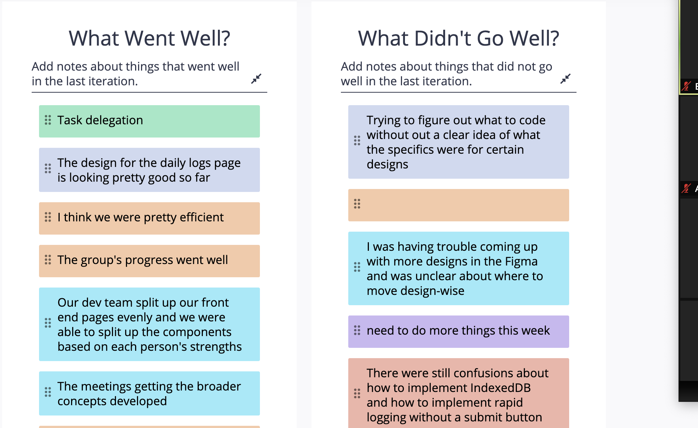
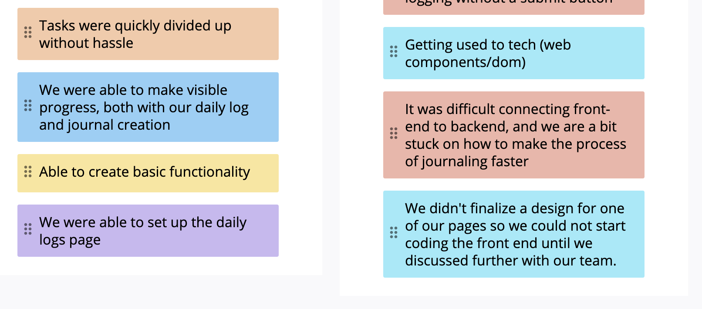
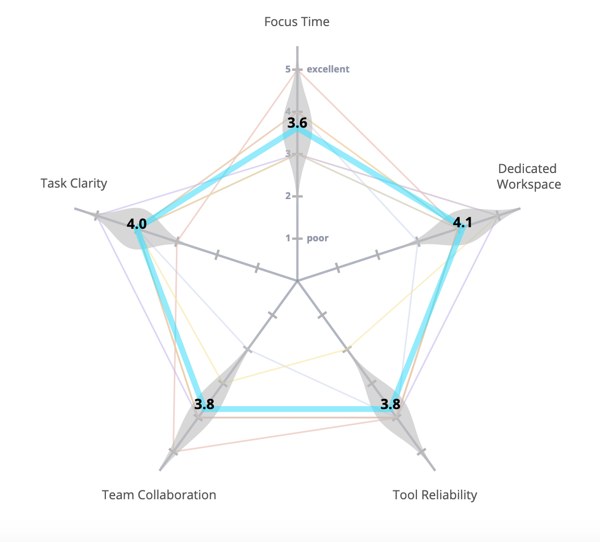
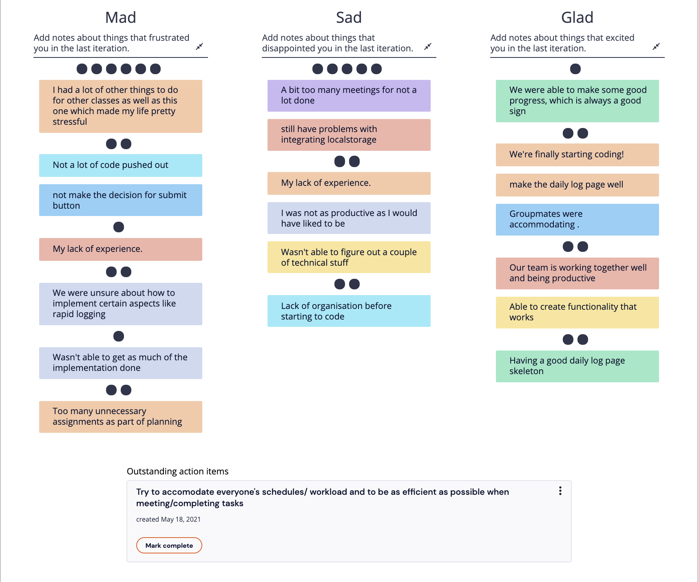

# 05/17/21 - CSE 110 Group 3 Meeting

## Meeting Information

*Type of Meeting*: Sprint 1 Retrospective   
*Time/Place*: Zoom 4:45-5:15 & asynchronously

*Attendance*:
- [X] Amy Nguyen
- [X] Brian Chen
- [X] Aman Aggarwal
- [X] Andrew Slater
- [X] Brian Seo
- [X] Eric Chen
- [X] Shirley Qi
- [X] Yunhao Du
- [ ] Matei-Alexandru Gardus

## Agenda

### Retrium Retrospective

### Top 5 voted thoughts from Retrium Retrospective
- There were still confusions about how to implement IndexedDB and how to implement rapid logging without a submit button
- We were able to make visible progress, both with our daily log and journal creation
- It was difficult connecting front-end to backend, and we are a bit stuck on how to make the process of journaling faster
- Our dev team split up our front end pages evenly and we were able to split up the components based on each person's strengths
- The design for the daily logs page is looking pretty good so far

### Sad, Mad, Glad   
- workload and other factors outsie of class made it a little difficult working on the project  
- there wasn't too much done, due to some uncertainty about the tech as well as planning the specific implementation  
- were able to at least get started and have some basic functionalities down  

### Action items
- Work on indexedDB
- Rapid logging without submit button
