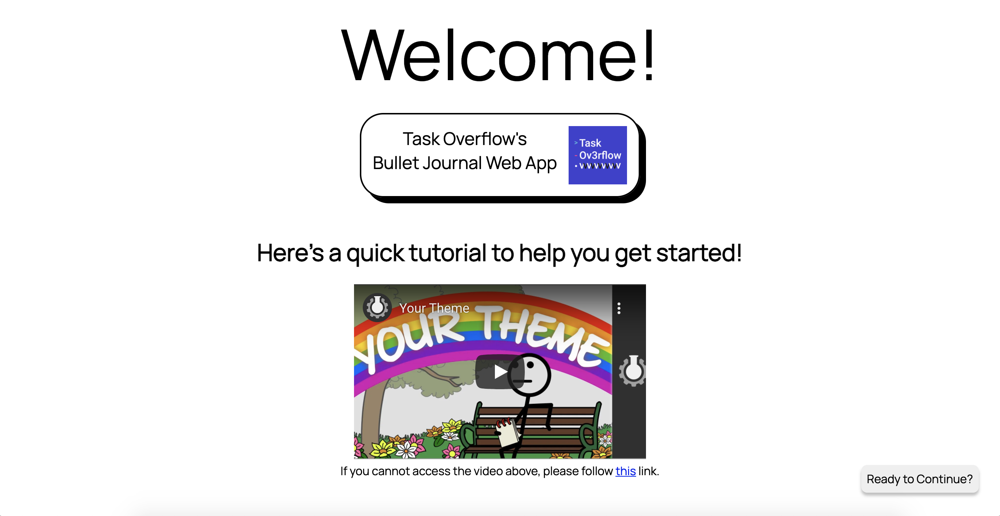
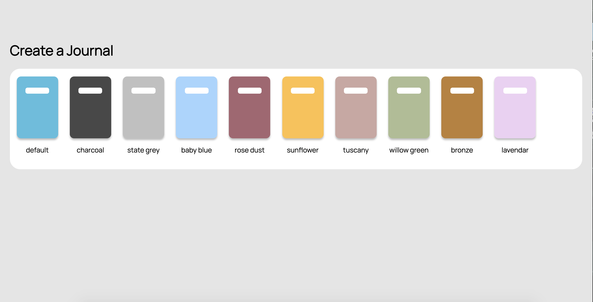
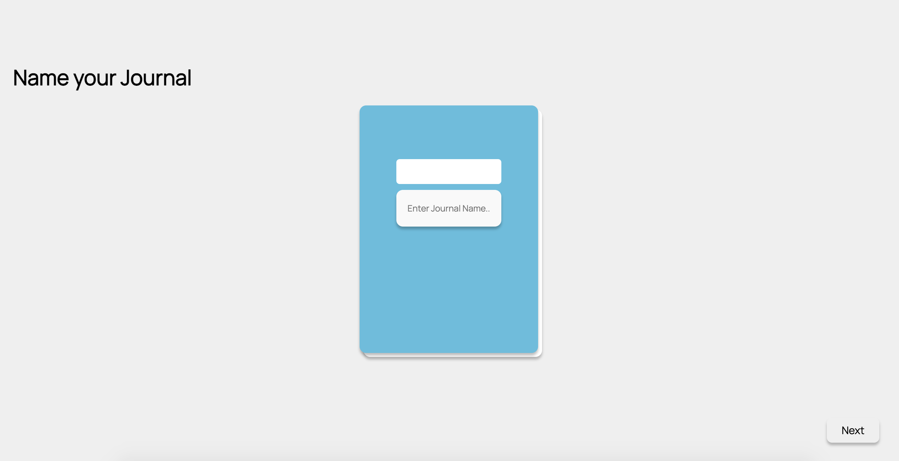
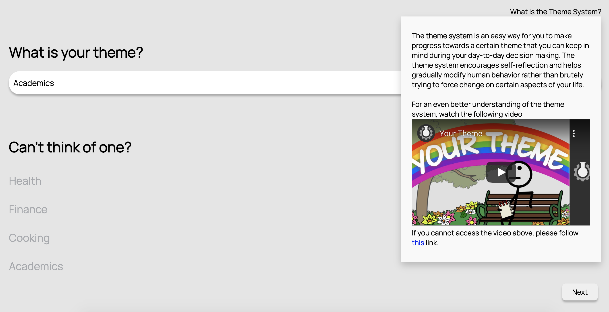
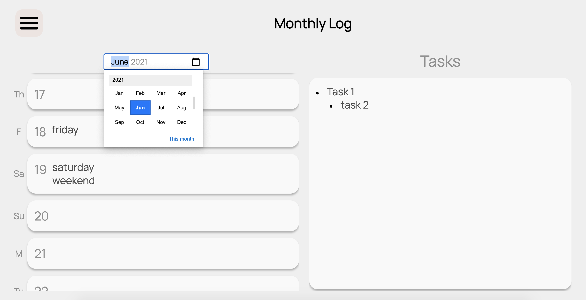
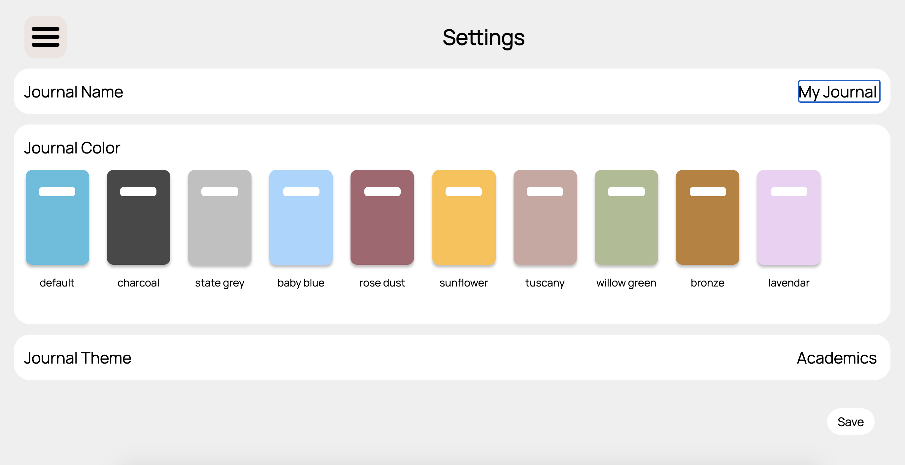

# Pages

## Welcome 

Welcome page for the first time user that displays the team name & logo and provides an onboarding/tutorial video for users to get started with the BuJo.

Functionalities: 
- Tutorial Video
- Links to Journal Creation

Contained Components: n/a

 

&nbsp;   

## Journal Creation

Connection of multiple pages that guides the user in creating and setting up their BuJo.

### Journal Picker

Page where the user can pick the style of the journal, which will represent the background color of all other pages.

Functionalities: 
- journal style picker
- links to journal name page

Contained Components: JournalIcon

 

&nbsp;   

### Journal Name

Page where the user can pick the name of the journal, which will appear on the home page.

Functionalities: 
- journal name creation
- links to theme page

Contained Components: n/a

 

&nbsp;   

### Theme

Page where the user can pick the theme for their BuJo, in accordance with the Theme System.

Functionalities:
- pick theme
- links to home page

Contained Components: n/a

 

&nbsp;   

## Home & Daily Log

Home (main) page for the BuJo that contains the daily log as well as the daily habit trackers.

Functionalities:
- add, edit, delete daily log bullets
- view and add habits for the day
- view keyboard shortcuts for rapid logging
- view current date

Contained Components: DailyHabit, BulletList, DailyLogBullet, Menu/Navbar

 

&nbsp;   

## Habits & Trends

Description

Functionalities:
- add, view, delete habits
- customize habit styles

Contained Components: Tracker, Menu/Navbar

 

&nbsp;       

## Past (Daily) Logs

Page for looking at previous days' daily logs

Functionalities:
- read-only past daily logs
- navigate to other days/months/years

Contained Components: DailyLogBullet, BulletList, Menu/Navbar

 

&nbsp;   

## Monthly Log

Page for monthly logs, with a calendar and a tasks section.

Functionalities:
- add, edit, delete monthly calendar notes
- add, edit, delete monthly task notes
- navigate to other months/years 

Contained Components: EventWrapper, BulletList, SimpleBullet, TaskBullet, Menu/Navbar

 

&nbsp;   

## Collections

Page for creating collections, where the user can create custom categories that organizes related info.

Functionalities:
- add, edit, delete collection categories
- add, edit, delete tasks under within each category

Contained Components: Collection, BulletList, TaskBullet, Menu/Navbar

 

&nbsp;   

## Settings

Page for editing the journal, as created in the Journal Creation pages.

Functionalities:
- edit journal name
- edit journal style
- edit journal theme

Contained Components: Menu/Navbar

 
